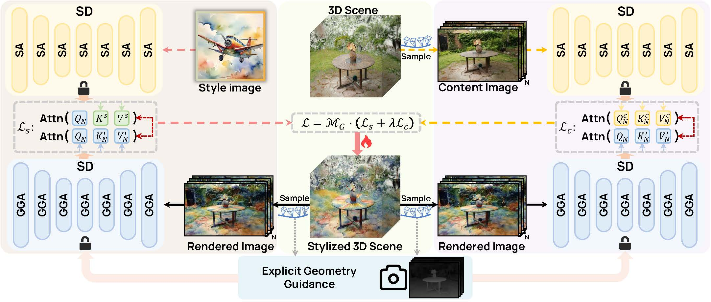

<div align="center">
<h1>
DiffStyle3D: Consistent 3D Gaussian Stylization via Attention Optimization
</h1>

<div>
    Yitong Yang<sup>1</sup>, &ensp;
    Xuexin Liu<sup>1</sup>, &ensp;
    Yinglin Wang<sup>1†</sup>, &ensp;
    Jing Wang<sup>1</sup>, &ensp;
    Hao Dou<sup>1</sup>, &ensp;
    Changshuo Wang<sup>2</sup>, &ensp;
    Shuting He<sup>1†</sup>, &ensp;
</div>

<div>
    <sup>1</sup>School of Computing and Artificial Intelligence, Shanghai University of Finance and Economics, Shanghai, China.
    <br>
    <sup>2</sup>Department of Computer Science University College London, London, United Kingdom.<br>
    <sup>†</sup>Corresponding Author.
</div>

<sub></sub>

<p align="center">
    <span>
        <a href="https://arxiv.org/pdf/2601.19717" target="_blank">
        </a> &emsp;  &emsp;
        
        
    </span>
</p>
</div>

## 💡 Overview
we propose **DiffStyle3D**, a novel diffusion-based paradigm for 3DGS style transfer that directly optimizes in the latent space. Specifically, we introduce an Attention-Aware Loss that performs style transfer by aligning style features in the self-attention space, while preserving original content through content feature alignment. Inspired by the geometric invariance of 3D stylization, we propose a Geometry-Guided Multi-View Consistency method that integrates geometric information into self-attention to enable cross-view correspondence modeling. Based on geometric information, we additionally construct a geometry-aware mask to prevent redundant optimization in overlapping regions across views, which further improves multi-view consistency.


## 📢 News

* **[2026-06]** We have open-sourced the code.
* **[2026-05]** Our paper is accepted by **ICML 2026**! 🎉

## 🔧 Prepare

### Requirements
- Python **3.10** (required)
- CUDA **12.1** (recommended)
- NVIDIA GPU

### 1. Clone repositories

```shell
# Clone 3D Gaussian Splatting (for scene reconstruction)
git clone https://github.com/graphdeco-inria/gaussian-splatting --recursive

# Clone DiffStyle3D
git clone https://github.com/yangyt46/DiffStyle3D.git
cd DiffStyle3D
```

### 2. Install dependencies

```shell
# Install Python dependencies
pip install -r requirements.txt
```

### 3. Install local CUDA extensions

The following packages must be built and installed from the `gaussian-splatting` submodule directory:

```shell
# Go to the gaussian-splatting submodules directory
cd <path-to-gaussian-splatting>/submodules

# Install simple-knn
pip install ./simple-knn

# Install diff-gaussian-rasterization
pip install ./diff-gaussian-rasterization

# Install fused-ssim
pip install ./fused-ssim

# Go back to DiffStyle3D
cd <path-to-DiffStyle3D>
```

### 4. Download Stable Diffusion model

DiffStyle3D uses Stable Diffusion v1.5 as the style prior. You can either use the online Hugging Face model or download it locally:

**Option A — Online (default):** The model will be downloaded automatically from Hugging Face on first run.

**Option B — Local (recommended for reliability):**

```shell
# Install Hugging Face CLI
pip install huggingface_hub

# Download the model
huggingface-cli download runwayml/stable-diffusion-v1-5 --local-dir models/stable-diffusion-v1-5
```

Then pass `--sd_model_key "models/stable-diffusion-v1-5"` to the training script (see below).

## 📂 Datasets


[Tandt DB](https://repo-sam.inria.fr/fungraph/3d-gaussian-splatting/datasets/input/tandt_db.zip)

[Mip-NeRF 360](http://storage.googleapis.com/gresearch/refraw360/360_v2.zip)

## 🚀 Run

### Reconstruction scene
Reconstruct a scene based on 3DGS, with an example as follows:

```shell
cd gaussian-splatting
python train.py -s <path to COLMAP or NeRF Synthetic dataset>
```

### Style transfer
Perform style transfer based on the reconstructed scene, with an example as follows:

Edit `train.sh` to set your paths, then run:

```shell
bash train.sh
```

Key arguments:
| Argument | Description |
|---|---|
| `--source_path` | Path to the COLMAP / NeRF dataset |
| `--model_path` | Output directory |
| `--start_checkpoint` | Path to the pre-trained 3DGS checkpoint (`.pth`) |
| `--style_image_path` | Path to the style reference image |
| `--sd_model_key` | Stable Diffusion model path or Hugging Face repo ID (default: `stable-diffusion-v1-5/stable-diffusion-v1-5`) |
## 🎓 Citing DiffStyle3D

If you use DiffStyle3D in your research, please use the following BibTeX entry.

```
@article{yang2026diffstyle3d,
  title={DiffStyle3D: Consistent 3D Gaussian Stylization via Attention Optimization},
  author={Yang, Yitong and Liu, Xuexin and Wang, Yinglin and Wang, Jing and Dou, Hao and Wang, Changshuo and He, Shuting},
  journal={arXiv preprint arXiv:2601.19717},
  year={2026}
}
```